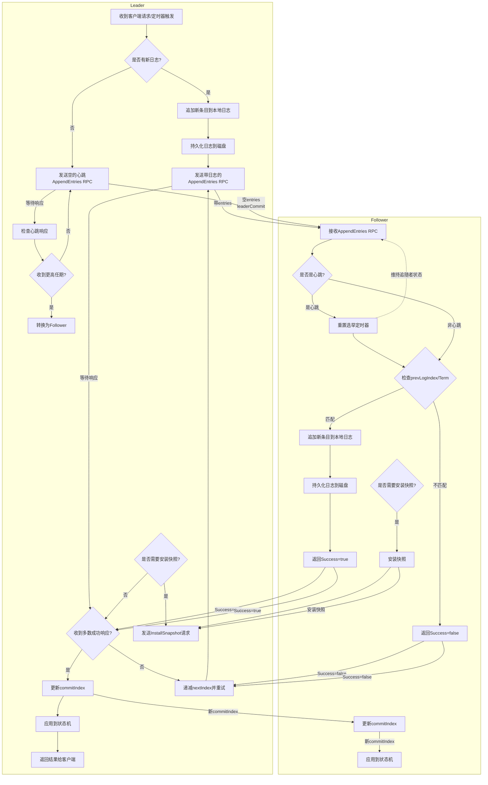

# TRaft

A raft component implemented by golang.

## brief introduction to raft

**raft** is a consensus algorithm for managing a replicated walogs. It is designed to be easy to understand and implement,
while still being efficient and fault-tolerant.

### key concepts

| concept                 | description                                                                                                                                                                               |
|-------------------------|-------------------------------------------------------------------------------------------------------------------------------------------------------------------------------------------|
| leader                  | the node that is currently in charge of the cluster. It is responsible for managing the walogs and coordinating the other nodes.                                                             |
| follower                | a node that is not the leader. It receives walogs entries from the leader and applies them to its own walogs.                                                                                   |
| candidate               | a node that is trying to become the leader. It sends out requests for votes from the other nodes in the cluster.                                                                          |
| term                    | a logical time period in which a leader is elected. Each term is identified by a unique number.                                                                                           |
| walogs                     | a sequence of entries that are replicated across the nodes in the cluster. Each entry contains a command and a term number.                                                               |
| commit index            | the index of the last entry that has been committed. This is used to ensure that all nodes have the same view of the walogs.                                                                 |
| last applied index      | the index of the last entry that has been applied to the state machine. This is used to ensure that all nodes have the same view of the state machine.                                    |
| next index              | for each server, index of the next walogs entry to send to that server(initialized to leader last walogs index + 1                                                                              |
| match index             | for each server, index of highest walogs entry known to be replicated on server(initialized to 0, increases monotonically)                                                                   |
| snapshot                | a snapshot of the state machine at a given point in time. This is used to reduce the size of the walogs and improve performance.                                                             |
| append entries          | a message sent from the leader to the followers to replicate walogs entries. It contains the term number, the index of the last entry, and the entries to be replicated.                     |
| request vote            | a message sent from a candidate to the other nodes in the cluster to request votes. It contains the term number, the index of the last entry, and the candidate ID.                       |
| heartbeat               | a message sent from the leader to the followers to keep them alive. It contains the term number and the index of the last entry.                                                          |
| election timeout        | the amount of time a node will wait before starting an election. This is used to prevent split votes and ensure that a leader is elected quickly.                                         |
| append entries response | a message sent from the followers to the leader in response to an append entries request. It contains the term number and the index of the last entry.                                    |
| request vote response   | a message sent from the other nodes in the cluster in response to a request vote request. It contains the term number and a boolean value indicating whether the vote was granted or not. |
| state machine           | the application that is being replicated across the nodes in the cluster. It is responsible for applying the walogs entries and maintaining the state of the application.                    |
| persistence             | the process of saving the walogs and state machine to disk. This is used to ensure that the data is not lost in case of a crash.                                                             |

### two-phase commit

The two-phase commit protocol is a distributed algorithm that ensures that all nodes in a distributed system agree on a
single value. It consists of two phases:

1. **prepare phase**: the coordinator sends a proposal to all participants, asking them to prepare to commit the value.
2. **commit phase**: if more than half of participants agree that proposal, the coordinator sends a commit message to
   all participants, asking them to commit the value.

Raft is a variation of the two-phase commit protocol, with some additional features to handle failures and ensure
consistency. The process of raft two-phase commit is as follows:

1. The leader sends an `AppendEntriesRequest` to all followers, asking them to append the walogs entry to their logs.
2. If a follower receives the request and the walogs entry is valid, it appends the entry to its walogs and sends an
   `AppendEntriesResponse` back to the leader.
3. If the leader receives a majority of agreement `AppendEntriesResponse` messages from followers, it commits the walogs
   locally
   and invoke the state machine to apply the walogs entry.
4. The leader will send a commit index when the next heartbeat, indicating that the walogs entry has been committed.
5. The followers will compare the commit index with their own logs and apply the walogs entry to their state machine if it
   is greater than their own commit index.

### walogs invalidation

Log invalidation is a key concept in the raft algorithm. It occurs when a follower receives a walogs entry that is not
valid or does not match the leader's walogs. This can happen for a number of reasons, including:

- The follower has a stale walogs out of date.
- The follower missed some walogs entries.
- The follower has a walogs entry but not valid or does not match the leader's walogs.

When a follower failed the walogs invalidation, it will send a `AppendEntriesResponse` back to the leader with
a false value.

Raft is a final consensus algorithm for logs, which means that it is designed to ensure that the majority of nodes in
the cluster have the same **walogs sequence before commit index**. So Log invalidation is a key concept in the raft
algorithm. It will be invoked when a follower receives a `AppendEntriesRequest` from the leader. The process of walogs
invalidation is as follows:

1. The follower compares the request's term and its term.
    - If the request's term is **less than the follower's term**, the follower will reject the request and send a
      `AppendEntriesResponse` back to the leader with a false value.
    - If the request's term is **greater than the follower's term**, the follower will update its term.
2. The follower will query the walogs based on the `prevLogIndex` and `prevLogTerm` in the request.
    - If the `prevLogIndex` is less than the snapshot's `lastIncludedIndex`, that means the follower has a stale walogs and
      needs to update its walogs. The follower will send a `AppendEntriesResponse` back to the leader with a false value.
      In this case, the leader will send a snapshot to the follower to update its walogs.
    - If the `prevLogIndex` is greater than the follower's last walogs index, that means the follower missed some walogs
      entries. The follower will send a `AppendEntriesResponse` back to the leader with a false value and the index of
      the last walogs entry. In this case, the leader will send walogs entries to the follower to update its walogs.
    - If the `prevLogIndex` is between the snapshot's `lastIncludedIndex` and the follower's last walogs index, that means
      the follower has a walogs entry matched the leader's `prevLogIndex`, there are two cases:
        - The `prevLogTerm` is mismatched with that walogs entry's term, that means the follower conflicted with the
          leader's walogs, the follower will find a walogs entry with the `prevLogTerm` - 1, and return its index and term to
          the leader.
        - The `prevLogTerm` is matched with that walogs entry's term, that means the follower has a valid walogs entry but
          with some invalid walogs entries, the follower will truncate its walogs to the `prevLogIndex`.
    - If the `prevLogIndex` is equal to the follower's last walogs index, that means the follower has a valid walogs entry and
      can append the new walogs entry to its walogs. The follower will append the new walogs entry to its walogs and send an
      `AppendEntriesResponse` back to the leader with a true value.

The raft leader will receive the `AppendEntriesResponse` from the followers and check the response's term and success
value. If there are a majority of followers that have successfully appended the walogs entry, the leader will commit the
walogs. If there is any follower returns a false value, the leader will process the response:

1. If the response's term is greater than the leader's term, the leader will update its term and step down to a
   follower.
2. Otherwise, the leader will check the error and conflict index in the response.
    - If the error is about `already snapshotted`, the leader will call `InstallSnapshot` to send a snapshot to the
      follower.
    - If the error is about `walogs invalidation`, the leader decrements the `nextIndex` of the follower to the
      `conflictIndex` and send a new `AppendEntriesRequest` to the follower.
    - If the error is about `walogs conflict`, the leader will decrement the `nextIndex` of the follower to the
      first walogs entry's index with the same `conflictTerm` and send a new `AppendEntriesRequest` to the follower.

BE AWARE: No matter heartbeat or append entries(write request), walogs invalidation will be invoked.

A brief flow chart is shown below:

